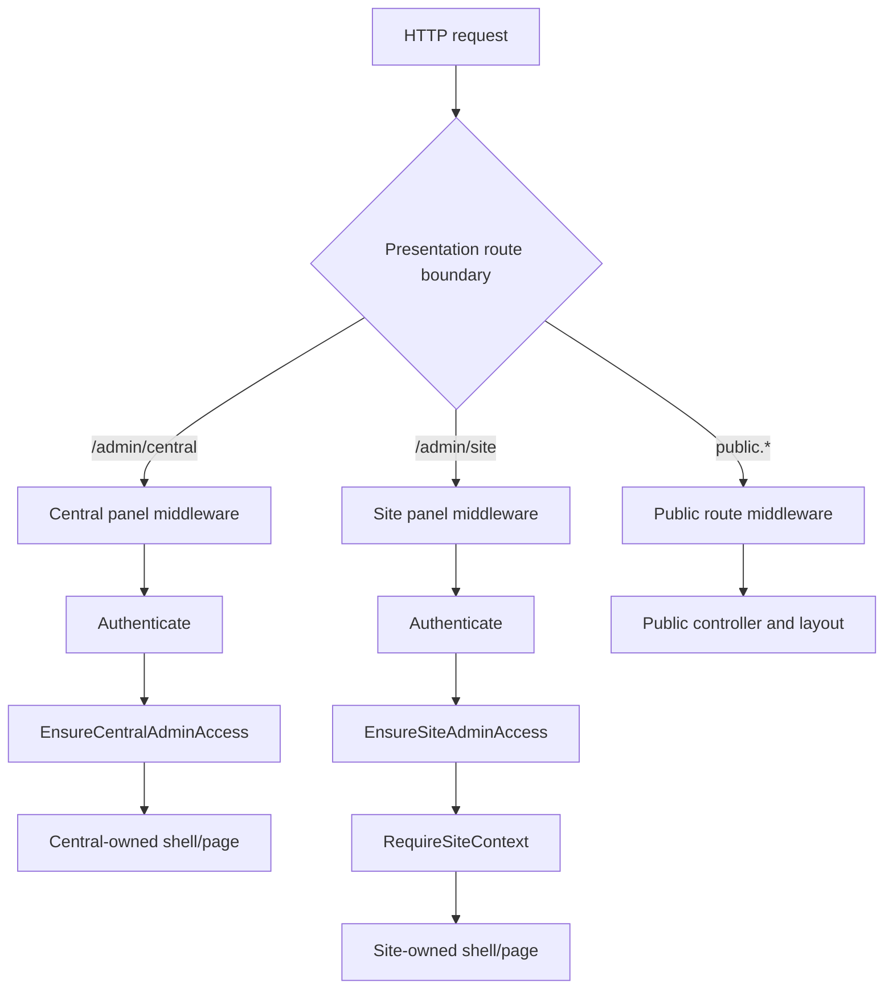

# Presentation context boundaries

Task range: P00-007–P00-014

Phase: 0.2 — Presentation Context Boundaries

Last verified: 2026-08-04

CatalogHub is one Laravel application with three presentation contexts. Context-owned pages and resources do not import one another; shared application, domain and UI primitives remain reusable.

## Boundary registry

| Context | Entry point | Route ownership | Guard and access stack | Layout / asset root | Namespace |
| --- | --- | --- | --- | --- | --- |
| Central Admin | panel `central`, `/admin/central`; login `/admin/central/login` | `CentralAdminPanelProvider` and `routes/central.php`; Filament names start `filament.central.`, custom names start `central.` | `web` guard, Filament `Authenticate`, `EnsureCentralAdminAccess`; endpoint-specific gates remain additive | Central Filament shell and `layouts.central-admin`; `resources/css/central-admin.css` | `App\Filament\Central`; existing unmigrated resources remain under `App\Filament` |
| Site Admin | panel `site`, `/admin/site`; login `/admin/site/login` | `SiteAdminPanelProvider`; names start `filament.site.`; no resources are copied from Central | `web` guard, Filament `Authenticate`, `EnsureSiteAdminAccess`, then `RequireSiteContext` | Site Filament shell and `layouts.site-admin`; `resources/css/site-admin.css` | `App\Filament\Site` |
| Public Site | controlled bare host (`public.landing`) plus localized routes such as `/{locale}` (`public.home`) | `routes/public.php`; application-owned names start `public.` | no admin guard or admin access middleware; existing public throttles remain route-specific | `public.layouts.app`; `resources/css/public.css` | `App\Http\Controllers\Public` |

All three boundaries currently use the default Laravel `web` session guard where authentication applies. Public site resolution is owned by `ResolveSiteRuntimeContext` and `SiteResolver`: an active primary or alias bare host resolves the same runtime context and temporarily redirects to the site's configured default-locale route; unknown and archived hosts fail closed.

## Request flow

Authentication failures redirect to the login route owned by the selected admin panel. Authenticated users in the wrong context receive HTTP 403 before the page executes. Public requests never enter either admin access adapter.

## Access contracts

The presentation boundaries reuse the project's permission registry instead of introducing a second permission package:

- `CentralPanelPolicy` requires the registered `central.panel.access` permission. The foundation mapping grants it to Super Admin, Central Admin, Catalog Editor, and Translator; resource/page/action checks remain additive. P00-027 removed the role-name temporary adapter.
- `SitePanelPolicy` requires `site.panel.access` and an active membership for the selected site. A requested unassigned site is rejected instead of falling back to another tenant.
- P00-029 removed the role-name legacy adapter. Existing Site-owned resources that have not yet moved out of the Central Filament registration use `SiteOwnedCentralRouteAccess`: an explicit route-to-permission map plus active-membership check. It never admits Site users to Central Home or unrelated Central resources.
- These adapters are server-side middleware dependencies. UI visibility is not an access decision.

## Ownership and dependency rules

- New Central pages/resources belong below `App\Filament\Central`.
- New Site pages/resources belong below `App\Filament\Site`.
- Public controllers belong below `App\Http\Controllers\Public` and cannot import `App\Filament` UI.
- Central cannot import Site pages/resources, and Site cannot import Central pages/resources.
- Application services, domain services, contracts and shared UI primitives are allowed dependencies.
- Legacy `App\Filament\Pages` and `App\Filament\Resources` classes were not mass-moved in Phase 0.2. Their current registration is Central-owned; moving them requires separately scoped tasks.

The executable rule is `tests/Unit/Architecture/PresentationBoundaryTest.php` and includes representative forbidden and allowed dependency cases.

## Compatibility and deferred routing

`/admin` redirects to `/admin/central`. Old custom Central endpoints were moved behind `/admin/central` while preserving their route names, so internal callers using `route('central.*')` follow the boundary automatically. The two verified hard-coded GET consumers under `/central/media` and `/central/products/{product}/media` receive authenticated redirects to their canonical routes. No parallel legacy panel remains.

`/admin/site` is intentionally a context shell, not the final Site workspace. Routes such as `/admin/sites/{site}` and host/site resolution belong to later authorized phases; Phase 0.2 does not infer them.

The pre-change inventory remains available in [Phase 0.1 routes and panels](../planning/section-00/baseline/routes-and-panels.md).

## Phase 0.2 smoke contract

- Central fixture opens `/admin/central` and renders `data-presentation-context="central-admin"`.
- Site fixture opens `/admin/site` and renders `data-presentation-context="site-admin"` for its persisted site only.
- Public deterministic demo host opens `public.home` and renders `data-presentation-context="public-site"` without admin navigation.
- Route names, panel IDs/prefixes, documentation links and cross-context imports are checked in the automated suite.

P00-007–P00-014 are represented by executable tests and this registry; the Phase 0.2 checklist is closed when the related tests, formatter, static analysis and production build are green.
